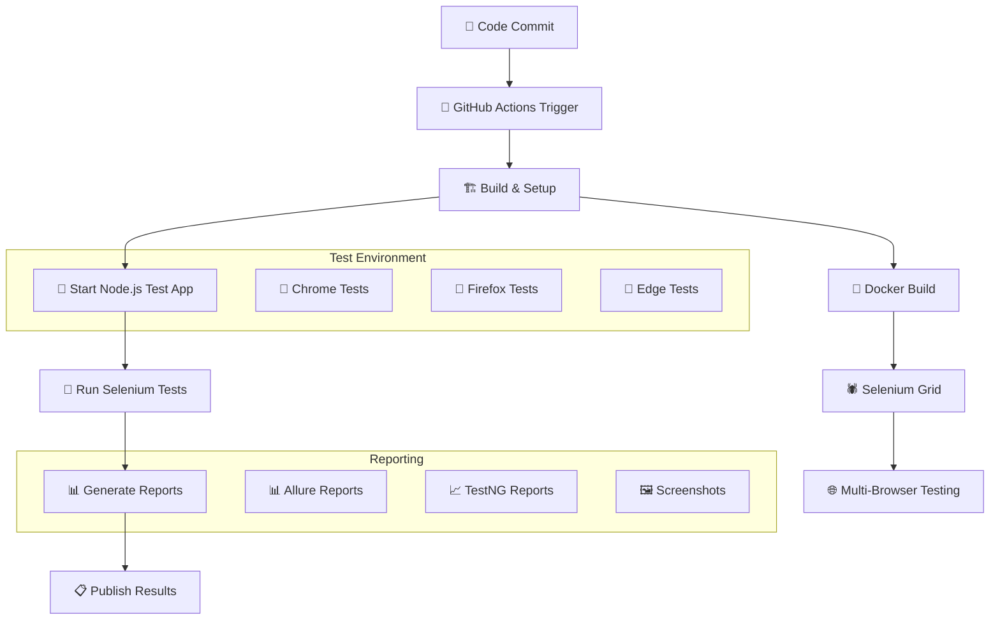

# 🚀 CI/CD Implementation Guide

This guide explains how to implement Continuous Integration and Continuous Deployment (CI/CD) for the Selenium Test Automation Framework with the Node.js test application.

## 📋 Table of Contents

- [🏗️ Architecture Overview](#️-architecture-overview)
- [🔧 Local Setup](#-local-setup)
- [🐳 Docker Implementation](#-docker-implementation)
- [🌐 GitHub Actions CI/CD](#-github-actions-cicd)
- [📊 Reports & Monitoring](#-reports--monitoring)
- [🛠️ Troubleshooting](#️-troubleshooting)

---

## 🏗️ Architecture Overview



---

## 🔧 Local Setup

### Prerequisites

- ✅ **Java 11+** - For Selenium framework
- ✅ **Maven 3.6+** - For build management
- ✅ **Node.js 16+** - For test application
- ✅ **Docker** - For containerized testing (optional)
- ✅ **Chrome/Firefox** - For local browser testing

### Quick Start

1. **Clone the repository:**
```bash
git clone https://github.com/sanglework17061992/selenium_framework_sang_le.git
cd selenium_framework_sang_le
```

2. **Run smoke tests:**
```bash
./run-tests.sh smoke
```

3. **Run full test suite:**
```bash
./run-tests.sh full
```

### Manual Setup

#### Step 1: Start Test Application
```bash
cd test-app
node server.js &
```

#### Step 2: Verify Application
```bash
curl http://localhost:8080/
curl http://localhost:8080/login.html
curl http://localhost:8080/products.html
curl http://localhost:8080/contact.html
```

#### Step 3: Run Selenium Tests
```bash
cd selenium-java-framework
mvn test -Dbrowser=chrome -Dheadless=true -DbaseUrl=http://localhost:8080
```

---

## 🐳 Docker Implementation

### Using Docker Compose (Recommended)

**Start everything with one command:**
```bash
docker-compose up --build
```

This will:
- 🌐 Start the Node.js test application
- 🕷️ Set up Selenium Grid with Chrome and Firefox nodes
- 🧪 Run the test suite
- 📊 Generate Allure reports

### Individual Docker Commands

**Build test application:**
```bash
cd test-app
docker build -t selenium-test-app .
docker run -p 8080:8080 selenium-test-app
```

**Build Selenium framework:**
```bash
cd selenium-java-framework
docker build -t selenium-framework .
docker run --network host selenium-framework
```

### Selenium Grid Setup

**Start Selenium Grid:**
```bash
# Hub
docker run -d -p 4444:4444 --name selenium-hub selenium/hub:4.15.0

# Chrome Node
docker run -d --link selenium-hub:hub selenium/node-chrome:4.15.0

# Firefox Node  
docker run -d --link selenium-hub:hub selenium/node-firefox:4.15.0
```

**Run tests against Grid:**
```bash
mvn test -Dbrowser=chrome -DbaseUrl=http://localhost:8080 -DgridUrl=http://localhost:4444
```

---

## 🌐 GitHub Actions CI/CD

### Pipeline Features

The CI/CD pipeline (`.github/workflows/ci-cd-pipeline.yml`) includes:

- 🏗️ **Automated Build** - Compiles Java and Node.js components
- 🧪 **Multi-Stage Testing** - Smoke tests → Regression tests
- 🌐 **Cross-Browser Testing** - Chrome, Firefox, Edge
- 📊 **Report Generation** - Allure and TestNG reports
- 🔔 **Notifications** - Success/failure alerts

### Trigger Conditions

The pipeline triggers on:
- 📝 **Push** to main/develop/implementation branches
- 🔄 **Pull Requests** to main/develop
- ⏰ **Scheduled** runs (daily at 2 AM UTC)
- 🎛️ **Manual** execution with parameters

### Manual Execution

You can trigger the pipeline manually with custom parameters:

1. Go to **Actions** tab in your GitHub repository
2. Select **🚀 Selenium Test Automation CI/CD Pipeline**
3. Click **Run workflow**
4. Choose parameters:
   - **Test Suite:** smoke, regression, or full
   - **Browser:** chrome, firefox, or edge
   - **Environment:** test, staging, or qa

### Pipeline Stages

#### 🏗️ **Build & Setup**
- Sets up Java 11 and Node.js 18
- Installs dependencies
- Starts test application
- Verifies endpoints
- Compiles Selenium framework

#### 🧪 **Smoke Tests**
- Runs critical test scenarios
- Tests on Chrome and Firefox
- Quick feedback (5-10 minutes)

#### 🔄 **Regression Tests**
- Comprehensive test suite
- All browsers (Chrome, Firefox, Edge)
- Parallel execution
- Full feature coverage

#### 📊 **Report Generation**
- Combines all test results
- Generates Allure reports
- Creates test summary
- Uploads artifacts

---

## 📊 Reports & Monitoring

### Allure Reports

**Local Allure setup:**
```bash
# Download Allure
curl -L -o allure.tgz https://github.com/allure-framework/allure2/releases/download/2.24.0/allure-2.24.0.tgz
tar -xzf allure.tgz

# Generate reports
./allure-2.24.0/bin/allure generate selenium-java-framework/target/allure-results --clean

# Serve reports
./allure-2.24.0/bin/allure serve selenium-java-framework/target/allure-results
```

**Docker Allure service:**
```bash
docker-compose up allure-reports
# Access at http://localhost:5050
```

### Report Locations

- 📊 **Allure Reports:** `selenium-java-framework/target/allure-report/`
- 📈 **TestNG Reports:** `selenium-java-framework/target/surefire-reports/`
- 🖼️ **Screenshots:** `selenium-java-framework/target/screenshots/`
- 📋 **Logs:** `test-app/server.log`

### GitHub Actions Artifacts

After each pipeline run, download:
- 📊 Combined test reports
- 🖼️ Failure screenshots  
- 📋 Execution logs
- 📈 Trend analysis data

---

## 🛠️ Troubleshooting

### Common Issues

#### ❌ **Test App Won't Start**
```bash
# Check port availability
lsof -i :8080

# Kill existing processes
pkill -f "node.*server.js"

# Check logs
tail -f test-app/server.log
```

#### ❌ **Tests Fail to Connect**
```bash
# Verify test app is running
curl http://localhost:8080/

# Check test configuration
cat selenium-java-framework/src/test/resources/config.properties
```

#### ❌ **Browser Driver Issues**
```bash
# Update WebDriver versions in pom.xml
# Or use WebDriverManager (already included)

# For Docker: Use selenium/standalone-* images
docker run -d -p 4444:4444 selenium/standalone-chrome:4.15.0
```

#### ❌ **Memory Issues**
```bash
# Increase JVM memory
export MAVEN_OPTS="-Xmx2g -XX:MaxPermSize=512m"

# For Docker
docker-compose up --scale selenium-chrome=1 --scale selenium-firefox=1
```

### Debug Commands

**Check application health:**
```bash
curl -v http://localhost:8080/
```

**Test Selenium Grid:**
```bash
curl http://localhost:4444/grid/api/hub/status
```

**View running containers:**
```bash
docker ps
docker logs <container_name>
```

**Maven debug:**
```bash
mvn test -X -Dmaven.test.failure.ignore=true
```

### Performance Optimization

#### Local Testing
- Use headless browsers: `-Dheadless=true`
- Parallel execution: `-Dparallel=methods -DthreadCount=3`
- Reduce wait times: `-DexplicitWait=5`

#### CI/CD Pipeline
- Cache Maven dependencies
- Use build matrices for parallel browser testing
- Optimize Docker layer caching
- Set resource limits

#### Docker Optimization
```yaml
# docker-compose.override.yml
services:
  selenium-tests:
    environment:
      - MAVEN_OPTS=-Xmx1g
    deploy:
      resources:
        limits:
          memory: 2g
```

---

## 🎯 Best Practices

### 💡 **Development Workflow**

1. **Local Testing First**
   ```bash
   ./run-tests.sh smoke  # Quick validation
   ```

2. **Feature Branch Testing**
   ```bash
   git checkout -b feature/new-test
   ./run-tests.sh full   # Comprehensive testing
   ```

3. **Pre-merge Validation**
   ```bash
   docker-compose up --build  # Full environment test
   ```

### 💡 **CI/CD Configuration**

- **Environment Variables:** Use GitHub Secrets for sensitive data
- **Parallel Jobs:** Optimize for fastest feedback
- **Artifact Retention:** Balance storage costs vs. debugging needs
- **Notification Setup:** Configure team alerts

### 💡 **Monitoring & Maintenance**

- **Regular Updates:** Keep browser versions current
- **Performance Tracking:** Monitor test execution times
- **Flaky Test Management:** Identify and fix unstable tests
- **Capacity Planning:** Scale Grid nodes based on demand

---

## 📞 Support

For questions or issues:
- 📚 Check this documentation first
- 🐛 Create GitHub issues for bugs
- 💬 Use team chat for quick questions
- 📧 Contact the automation team for complex issues

---

*This CI/CD setup ensures reliable, fast, and comprehensive testing of your web application across multiple browsers and environments! 🚀*