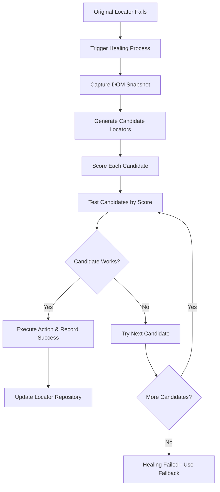

# Selenium Java Test Automation Framework

A comprehensive, enterprise-grade Selenium WebDriver framework built with Java, TestNG, and Allure reporting for robust web application testing with advanced self-healing capabilities.

## 📑 Table of Contents

### Quick Start
- [🚀 Features](#-features)
- [📋 Prerequisites](#-prerequisites)
- [🛠 Installation & Setup](#-installation--setup)
- [🧪 Running Tests](#-running-tests)

### Core Framework
- [🏗 Framework Structure](#-framework-structure)
- [🔧 Key Components](#-key-components)
- [📊 Test Reporting](#-test-reporting)

### Self-Healing System
- [🔧 Self-Healing Locator System](#-self-healing-locator-system)
- [⚙️ Healing Configuration](#️-healing-configuration)
- [🧩 Healing Usage Examples](#-healing-usage-examples)
- [📊 Healing Performance & Monitoring](#-healing-performance--monitoring)

### Advanced Features
- [🔄 Authentication Support](#-authentication-support)
- [🌐 Browser Configuration](#-browser-configuration)
- [📈 Advanced Features](#-advanced-features)

### Companion Tools
- [🧪 Test Application](#-test-application)
- [🔍 Smart Locator Capture](#-smart-locator-capture)

### Support & Maintenance
- [🎯 Best Practices](#-best-practices)
- [🔍 Troubleshooting](#-troubleshooting)
- [🤝 Contributing](#-contributing)

---

## 🚀 Features

### Core Framework Capabilities
- **Multi-Browser Support**: Chrome, Firefox, Edge, Safari (with automatic driver management)
- **Parallel Test Execution**: Run tests concurrently across multiple browsers/devices
- **Self-Healing Locators**: Automatic element detection and healing when locators break
- **Custom Element Wrappers**: Built-in waits, retries, and enhanced error handling
- **Page Object Model**: Clean separation of test logic and page structure
- **Advanced Reporting**: Allure Framework integration with screenshots and detailed logs
- **Configuration Management**: Centralized property-based configuration
- **Comprehensive Logging**: Log4j2 integration with timestamped log files
- **Retry Mechanism**: Automatic retry for flaky tests
- **Authentication Helpers**: Built-in support for session management

### Technical Architecture
- **Design Patterns**: Factory, Singleton, Page Object Model
- **Self-Healing System**: Intelligent element recovery with fuzzy matching algorithms
- **Element Abstraction**: Custom wrapper classes for reliable element interactions
- **Wait Strategies**: Intelligent explicit waits with customizable timeouts
- **Error Handling**: Comprehensive exception handling and recovery mechanisms
- **Thread Safety**: Full support for parallel test execution

## 📋 Prerequisites

- **Java 11+** (OpenJDK or Oracle JDK)
- **Maven 3.6+**
- **Chrome/Firefox/Edge browsers** installed
- **Internet connection** for WebDriverManager

## 🛠 Installation & Setup

### 1. Clone and Navigate
```bash
git clone https://github.com/sanglework17061992/sangle_selenium_framework.git
cd sangle_selenium_framework/selenium-java-framework
```

### 2. Install Dependencies
```bash
mvn clean install
```

### 3. Configure Test Environment
Edit `src/test/resources/config.properties`:
```properties
# Browser Configuration
browser=chrome
headless=false
implicit_wait=10
explicit_wait=15
page_load_timeout=30

# Application Under Test
base_url=http://localhost:8080
login_url=http://localhost:8080/login.html
products_url=http://localhost:8080/products.html

# Test Credentials
username=testuser
password=password123

# Self-Healing Configuration
healing.enabled=true
healing.mode=auto
healing.confidence.threshold=0.5
healing.max.candidates=10
```

### 4. Download Allure Commandline (for reporting)
```bash
curl -o allure-2.24.0.tgz -Ls https://repo1.maven.org/maven2/io/qameta/allure/allure-commandline/2.24.0/allure-commandline-2.24.0.tgz
tar -zxf allure-2.24.0.tgz
```

## 🧪 Running Tests

### Execute All Tests
```bash
mvn test
```

### Run Specific Test Class
```bash
mvn test -Dtest=LoginTest
mvn test -Dtest=RealHealingDemo
```

### Run with Different Browser
```bash
mvn test -Dbrowser=firefox
mvn test -Dbrowser=edge
```

### Run in Headless Mode
```bash
mvn test -Dheadless=true
```

### Run Self-Healing Demo
```bash
mvn test -Dtest=RealHealingDemo#testCompleteLoginFlowWithHealing
```

### Parallel Execution
```bash
mvn test -DsuiteXmlFile=src/test/resources/testng.xml
```

## 📊 Test Reporting

### Generate Allure Report
```bash
# After test execution
./allure-2.24.0/bin/allure serve target/allure-results
```

The report will open automatically in your browser showing:
- Test execution summary with pass/fail statistics
- Detailed test steps with screenshots
- Error logs and stack traces
- Self-healing events and suggestions
- Test execution timeline
- Environment information

## 🏗 Framework Structure

### Architecture Overview
[Link Mermaid](https://mermaid.live/edit#pako:eNrdWm1v2zgS_iuCigVcxA62m-TaCkWAxLGvXjSbIs62h0W-MBJt80qLPpJK4nSb337DF0mkRNmOd4EDzkBTiZwZDh_ODGfG_h6nLMNxEqcUCXFB0Jyj5W0eweenn6Ih4zgawwh-YPxbNFQ0WJhpzRB9xXcXnNxjHn03w-rz4QPJJeYzlOLTUzP8w_znshq-MUol42uf3Q6WzOozyDT5zYJjlH1iKaJJ5Lw8V4o81zwHKcxLbMZ7d5w9CMyTaCo5yef9aAHMFAuRRHeMUYzy10m9ny4pHTRzLDcT_KcgDsU9I5kzSYSZOrtHhKI7ihWNVcoh41hIxDvFDIyiwwVny1LdHfdoWceE4xl73It3lM33W3SKZoiTTvQCljNk-YzML1GO5k3Dm8LJUixZ7tkOyQG4PMWJz-pQrDhbYS4JBqU_V8_-AU-sFKVkhxxFZtnXvW94XRrb6_LBJz038HRwtA1AsRgr7oUkEvHRIt_rZEcC_85pr0Oh0eOKkpTIr4hIRQN-7BNcY8nXQ1bk_rR3SBA4Rnmx9OKEVftmvcL-gWGgxBxJ4h_Z8OP11eWofh9Prkfjq3_VA6OLfzrT07Px2fWkfr_6PLo-q18no8ZJZjiXZEY6cFTOTMSKovVvEPqCJDPwMUdKdWbOPsPIqAOIRhQvgTcUUNV8Oe0Bhe6E5BAXXZRemaAY9K5XFOIiRFHQae2M5rCj9n5ePcCBf8R0pYXB8--SUGeaV8fetAlH315Lm37kKNGP3LVfNwzPijD-b9_cGAxm-S0cOc1J4Sxs80SMchVRs06XuMGPsssMziQM3hUS9zzdA8QKwDHjX4ggNn43NLUEQ7URFCYRKWeUTnLJvhD84BMEwuB5ISHQuVZyYIb2PgiN8lciF9rNg3BvQ9NooOw_iKko7pYmtDQkZ6wAucOOY-ZkvpCByQAq6jjP2aMHix3bGxeptiNBiGMBDQ1TgCJ0tevxszy72S4C0PuCaBEGbgWXP4Avg_mDnrxBdyGbwhSn8ozSrcBdwC2UsQffoMrBvaEz65-vtZdt3n9JakC4V3-3E0_yDD_2iPqrQ1MQ1qkmxtlGV6f0aqWuIX15fiJCPhuyZ8_-LwsqiZHX8oFmrAey2QCuZApSoulaSLx0AbczL4r4g4VhsplHUgppZzSpzlAqApOwFOamdRMfYPsteCcMsFEqPHvQ1v5FNtKPmiu_8EYAnjns2KoR8jyUn2M1vSFaWe6pBFiEJKk--0u0skffv7r7Nxz0c6fPlCC0IvEgA_TmkN0mNkwHkHt5rO4ErVu1QDh0dLOzbeX2iZi7aQd-4buErjIDmu-V33e6g9X6Gq-YIKq4BB9vDjnkwE_XT2rnZ_bJxY8twZ1ynGoYpmS5ovjCGesuG7rUOyA5kQTmnnAb8rZpqyBgte95xwFO34ixJqZBgXy-fm5IgFvJ3POeCAg4wDAtVlAJ6GrZPrmy2oGR45TxbFqkKdxEs0IlMZgbUb74QFAJ2E0oiL_IV-t6SPF0JS3dbuOFy71MsCvgYqNLICANlixzTBhemuEcCo4Uq66HWDAKIkzS5EpAj0OUZyQD7xaB8i1gix16bgevlKkUdW3b01sRDNuqK_qm8lqWq393hWmOqu14fpTrro0O2qwBt_PukpUsuGKY5mgFW5Bbja-u1Sf5jG0jH9gV7D0nvhD0K7pH05STlawSEiVhI89ncKQpK7g54QZPMwyXkS2alN26CLCPJgoaJdCxCAN4xbC512cKZEjJnKMEcU7IHam3PlhABadGpx-17bfcRjVsRXhtPkTTgqpWElkSijiR6ymEI9xjkCMQUFqVccIukZaCLGx6OGSOldSqCKzFb5ZcDzbkhox4ibgMAbubx_8_4Twunp7WH3HBdXg3koP7wd0SmzZeX-6hZksrA9jFsgW6x64-IR3bF5g6J4_LuxUDF2B12bpczw09yhheYt0TBSTFQnFWAXlaDYW1asoQrmqlWbRkdefEvwqWbwS2zMXEmFD8GclFoPao97GJiukwClag-1ZXzpuzx6A-vdfh5CtQaP7vj7tp1CrK2912tRA1yV_rHz7YNmCoIXhQrrH52rQ9L0X4iaGsF8zrhgXngOmGrvQNkTTcFcnRPVGVzA1T7AWnwQwyYKSfGASsJkiDAm5rVdGMCVbBtlUdQbUsxAMkup0EVMk1lV2g8qtW3QxbvauaoQ2dXqpXquwm00bH7mRac6o23wVesiHHuo-NqAg2_K5yT4kd8-ed8PVrzW6YO-k8tL2yul3R7oj9_qgSYcufS_gH62xpTFvf0GpdY1FQ2ZNkiVkhp1BL5Vl1LW9sMSm3hGs4-NWs9dpdk-KB0siZUfyOvqW4UEsgpHggDEAWo9KZrQVhV8vH7bHrbf9VSbYZv7esgP3riroJ-4cP9py8RAI_4hSyyrrfburluuTuqJYN2QUWujgwHHYK8jolitRJ3c0uC14XuS7y_o4FO8KuzsWoLinEgqyspfq_ARgMTr0vCpOoqGy6TVn_9CCJzDfJwl3Qbas2yWuxLarSaTYR1WfsUlla0wocDP489fiSCKIXBu8wZGVbbhtd1ZTfRmj-BlrK2xiDLKfNJpy70c0cfuekDZDfMtXaBQSGlfRQ284VXvC0PCOoHGwjtGuV0-qcWrQeR4mS4minvgHsXIaq-NtCF2h3tNH1y8nDwz89-aQs7S1POFXXXKFtNNlr79A3_WYvq0lCLlbnC5W96rewHexI3RbtnH14bffEOyzXJ_etK3CEQXJ_kbgfzznJ4kTyAvfjJeZLpF5jfYXcxnIBqN_GCTxmeIYgVbiNb_MfwLZC-R-MLUtOzor5Ik5mkMvBW7FS5Zz9TVdFAvBgrr_Kj5M3b7WIOPkeP8bJ0cm7w6P3705-OX7_5t3x0Zvjf_TjdZwcvz88Pnp7_Pb45OiXn0-OTt786MdPetGfD9-9PfnxX853Qdw)

```mermaid
classDiagram
    %% Core Framework Classes
    class WebDriver {
        <<interface>>
    }
    
    class DriverFactory {
        <<Factory>>
        -driverThreadLocal: ThreadLocal~WebDriver~
        +createDriver(browser: String, headless: boolean): WebDriver
        +createDriver(): WebDriver
        +getDriver(): WebDriver
        +quitDriver(): void
        +isDriverAvailable(): boolean
        +restartDriver(): void
        -createChromeDriver(headless: boolean): WebDriver
        -createFirefoxDriver(headless: boolean): WebDriver
        -createEdgeDriver(headless: boolean): WebDriver
        -createSafariDriver(): WebDriver
    }
    
    class ConfigManager {
        <<Singleton>>
        -instance: ConfigManager
        -properties: Properties
        +getInstance(): ConfigManager
        +getProperty(key: String): String
        +getBooleanProperty(key: String): boolean
        +getBrowser(): String
        +isHeadless(): boolean
        +getBaseUrl(): String
        +getExplicitWait(): int
        +getRetryCount(): int
    }
    
    %% Enums
    class BrowserType {
        <<enumeration>>
        CHROME
        FIREFOX
        EDGE
        SAFARI
        OPERA
        IE
        +getIdentifier(): String
        +getDisplayName(): String
        +fromIdentifier(String): BrowserType
    }
    
    %% Base Element Classes
    class BaseElement {
        <<abstract>>
        #driver: WebDriver
        #locator: By
        #name: String
        #waitHelper: WaitUtil
        #retryCount: int
        +BaseElement(driver: WebDriver, locator: By, name: String)
        +getElement(): WebElement
        +click(): void
        +isDisplayed(): boolean
        +isEnabled(): boolean
        +getText(): String
        +getAttribute(name: String): String
        +waitForVisible(): void
        +waitForClickable(): void
        +scrollIntoView(): void
    }
    
    class Button {
        +Button(driver: WebDriver, locator: By, name: String)
        +clickWithRetry(): void
        +isEnabled(): boolean
        +getButtonType(): String
        +submit(): void
        +doubleClick(): void
        +rightClick(): void
    }
    
    class TextBox {
        +TextBox(driver: WebDriver, locator: By, name: String)
        +type(text: String): void
        +clear(): void
        +clearAndType(text: String): void
        +getValue(): String
        +pressEnter(): void
        +pressTab(): void
        +selectAll(): void
    }
    
    class Dropdown {
        +Dropdown(driver: WebDriver, locator: By, name: String)
        +selectByText(text: String): void
        +selectByValue(value: String): void
        +selectByIndex(index: int): void
        +getSelectedText(): String
        +getAllOptions(): List~String~
        +isMultiSelect(): boolean
    }
    
    %% Self-Healing System
    class HealingBaseElement {
        <<abstract>>
        -healingManager: HealingManager
        -config: HealingConfiguration
        -pageName: String
        -elementName: String
        +HealingBaseElement(driver: WebDriver, locator: By, name: String, pageName: String)
        +getElement(): WebElement
        +triggerHealing(): void
        +canBeHealed(): boolean
        +getHealingStatistics(): Map~String,Object~
    }
    
    class HealingButton {
        -delegate: Button
        +HealingButton(driver: WebDriver, locator: By, name: String, pageName: String)
    }
    
    class HealingTextBox {
        -delegate: TextBox
        +HealingTextBox(driver: WebDriver, locator: By, name: String, pageName: String)
    }
    
    %% Healing System Core
    class HealingManager {
        <<Singleton>>
        -instance: HealingManager
        -locatorRepository: LocatorRepository
        -analyzer: Analyzer
        -domConnector: SimpleDomConnector
        +getInstance(): HealingManager
        +initialize(driver: WebDriver): void
        +healLocator(locator: By, context: String): Optional~By~
        +healAndRetry(locator: By, actionSupplier: Supplier): Optional~String~
        +recordSuccessfulInteraction(locator: By, elementName: String, pageName: String): void
        +getHealingStatistics(): Map~String,Object~
        +isHealingEnabled(): boolean
    }
    
    class HealingConfiguration {
        <<Singleton>>
        -instance: HealingConfiguration
        -enabled: boolean
        -mode: HealingMode
        -confidenceThreshold: double
        -maxCandidates: int
        +getInstance(): HealingConfiguration
        +isHealingEnabled(): boolean
        +getMode(): HealingMode
        +getConfidenceThreshold(): double
        +getMaxCandidates(): int
    }
    
    class SimpleDomConnector {
        -driver: WebDriver
        +SimpleDomConnector(driver: WebDriver)
        +captureDomSnapshot(): Map~String,Object~
        +getBrowserInfo(): Map~String,Object~
        -captureElementsViaJavaScript(): List~Map~
        -captureElementsViaPageSource(): List~Map~
    }
    
    %% Analyzer Interface and Implementation
    class Analyzer {
        <<interface>>
        +findCandidates(entry: LocatorEntry, domSnapshot: Map, maxCandidates: int): List~CandidateLocator~
        +calculateSimilarityScore(originalAttrs: Map, candidateElement: Map): double
        +calculateAttributeSimilarity(originalAttrs: Map, candidateAttrs: Map): double
    }
    
    class SmartAnalyzer {
        -confidenceThreshold: double
        +findCandidates(entry: LocatorEntry, domSnapshot: Map, maxCandidates: int): List~CandidateLocator~
        +calculateSimilarityScore(originalAttrs: Map, candidateElement: Map): double
        +calculateFuzzyHeuristicScore(entry: LocatorEntry, element: Map): double
    }
    
    %% Repository Classes
    class LocatorRepository {
        <<interface>>
        +saveLocatorEntry(entry: LocatorEntry): void
        +findLocatorEntry(locator: By, pageName: String): Optional~LocatorEntry~
        +saveHealingCandidate(suggestion: HealingSuggestion): void
        +findHealingCandidates(locator: By): List~HealingSuggestion~
    }
    
    class JsonLocatorRepository {
        -locatorsFilePath: String
        -suggestionsFilePath: String
        -objectMapper: ObjectMapper
        +JsonLocatorRepository()
        +initialize(): void
        +saveLocatorEntry(entry: LocatorEntry): void
        +findLocatorEntry(locator: By, pageName: String): Optional~LocatorEntry~
    }
    
    %% Page Object Classes
    class BasePage {
        <<abstract>>
        #driver: WebDriver
        #waitUtil: WaitUtil
        +BasePage(driver: WebDriver)
        +waitForPageLoad(): void
        +getCurrentUrl(): String
        +getTitle(): String
        +navigateToUrl(url: String): void
    }
    
    class LoginPage {
        -usernameField: TextBox
        -passwordField: TextBox
        -loginButton: Button
        +LoginPage(driver: WebDriver)
        +navigateToLoginPage(): void
        +login(username: String, password: String): void
        +loginWithDemoCredentials(): void
        +isOnLoginPage(): boolean
    }
    
    class HealingLoginPage {
        -usernameField: HealingTextBox
        -passwordField: HealingTextBox
        -loginButton: HealingButton
        +HealingLoginPage(driver: WebDriver)
        +login(username: String, password: String): void
        +isSuccessMessageDisplayed(): boolean
        +waitForLoginResult(timeoutSeconds: int): boolean
    }
    
    %% Utility Classes
    class WaitUtil {
        -driver: WebDriver
        -wait: WebDriverWait
        +WaitUtil(driver: WebDriver, timeoutSeconds: int)
        +waitForPresence(locator: By, elementName: String): WebElement
        +waitForVisibility(locator: By, elementName: String): WebElement
        +waitForClickability(locator: By, elementName: String): WebElement
    }
    
    class RetryUtil {
        <<Utility>>
        +executeWithRetry(action: Supplier, elementName: String, actionDescription: String, maxRetries: int): T
        +executeWithRetry(action: Runnable, elementName: String, actionDescription: String, maxRetries: int): void
    }
    
    %% Relationships
    DriverFactory --> BrowserType : uses
    DriverFactory --> WebDriver : creates
    
    BaseElement --> WebDriver : uses
    BaseElement --> WaitUtil : uses
    BaseElement --> RetryUtil : uses
    
    Button --|> BaseElement : extends
    TextBox --|> BaseElement : extends
    Dropdown --|> BaseElement : extends
    
    HealingBaseElement --|> BaseElement : extends
    HealingBaseElement --> HealingManager : uses
    HealingBaseElement --> HealingConfiguration : uses
    
    HealingButton --|> HealingBaseElement : extends
    HealingTextBox --|> HealingBaseElement : extends
    
    HealingButton --> Button : delegates
    HealingTextBox --> TextBox : delegates
    
    HealingManager --> LocatorRepository : uses
    HealingManager --> Analyzer : uses
    HealingManager --> SimpleDomConnector : uses
    
    SmartAnalyzer ..|> Analyzer : implements
    JsonLocatorRepository ..|> LocatorRepository : implements
    
    BasePage --> WebDriver : uses
    BasePage --> WaitUtil : uses
    LoginPage --|> BasePage : extends
    HealingLoginPage --|> BasePage : extends
    
    LoginPage --> Button : uses
    LoginPage --> TextBox : uses
    
    HealingLoginPage --> HealingButton : uses
    HealingLoginPage --> HealingTextBox : uses
```


### Key Architecture Patterns

- **🏭 Factory Pattern**: `DriverFactory` for WebDriver creation
- **🔒 Singleton Pattern**: `ConfigManager`, `HealingManager`, `HealingConfiguration`
- **📄 Page Object Model**: Clean separation of page structure and test logic
- **🎭 Decorator Pattern**: Healing elements enhance base elements with self-healing capabilities
- **📚 Repository Pattern**: `LocatorRepository` for data persistence
- **🔧 Strategy Pattern**: `Analyzer` interface with `SmartAnalyzer` implementation

### Directory Structure

```
selenium-java-framework/
├── src/
│   ├── main/java/
│   │   ├── com/automation/
│   │   │   ├── config/
│   │   │   │   └── ConfigManager.java          # Configuration management
│   │   │   ├── core/
│   │   │   │   └── DriverFactory.java          # WebDriver factory
│   │   │   ├── elements/
│   │   │   │   ├── BaseElement.java            # Abstract element wrapper
│   │   │   │   ├── Button.java                 # Button interactions
│   │   │   │   ├── TextBox.java                # Input field operations
│   │   │   │   ├── Dropdown.java               # Select handling
│   │   │   │   ├── Link.java                   # Link interactions
│   │   │   │   ├── Checkbox.java               # Checkbox operations
│   │   │   │   ├── Label.java                  # Text elements
│   │   │   │   └── RadioButton.java            # Radio button selection
│   │   │   ├── healing/                        # 🔧 Self-Healing System
│   │   │   │   ├── HealingManager.java         # Core healing orchestration
│   │   │   │   ├── HealingConfiguration.java   # Healing system config
│   │   │   │   ├── analyzer/
│   │   │   │   │   └── SmartAnalyzer.java      # Fuzzy heuristic algorithms
│   │   │   │   ├── repository/
│   │   │   │   │   ├── JsonLocatorRepository.java    # Candidate storage
│   │   │   │   │   └── HealingSuggestionRepository.java # Suggestions
│   │   │   │   ├── models/
│   │   │   │   │   ├── CandidateLocator.java   # Healing candidate model
│   │   │   │   │   ├── LocatorEntry.java       # Repository entry model
│   │   │   │   │   ├── LocatorInfo.java        # Locator information
│   │   │   │   │   └── HealingSuggestion.java  # Healing suggestion model
│   │   │   │   ├── elements/                   # Healing-enabled elements
│   │   │   │   │   ├── HealingBaseElement.java
│   │   │   │   │   ├── HealingButton.java
│   │   │   │   │   ├── HealingTextBox.java
│   │   │   │   │   ├── HealingLabel.java
│   │   │   │   │   └── HealingLink.java
│   │   │   │   └── utils/
│   │   │   │       ├── ElementAnalyzer.java    # DOM element analysis
│   │   │   │       ├── LevenshteinDistance.java # String similarity
│   │   │   │       └── DOMCapture.java         # Page structure capture
│   │   │   ├── pages/
│   │   │   │   ├── BasePage.java               # Common page functionality
│   │   │   │   ├── LoginPage.java              # Login page object
│   │   │   │   ├── HomePage.java               # Home page object
│   │   │   │   └── healing/
│   │   │   │       └── HealingLoginPage.java   # Healing-enabled login page
│   │   │   └── utils/
│   │   │       ├── WaitHelper.java             # Custom wait strategies
│   │   │       ├── RetryHelper.java            # Retry mechanism
│   │   │       └── LoggerUtil.java             # Logging utilities
│   └── test/java/
│       ├── com/automation/
│       │   ├── base/
│       │   │   └── BaseTest.java               # Base test setup
│       │   └── tests/
│       │       ├── LoginTest.java              # Login functionality tests
│       │       ├── ProductTest.java            # Product page tests
│       │       └── healing/
│       │           └── RealHealingDemo.java    # Self-healing demonstrations
├── healing/                                    # 📁 Healing Data Directory
│   ├── locator_repository.json                # Discovered healing candidates
│   └── healing_suggestions.json               # Healing suggestions history
└── src/test/resources/
    ├── config.properties                       # Test configuration
    ├── log4j2.xml                             # Logging configuration
    ├── allure.properties                      # Allure configuration
    └── testng.xml                             # TestNG suite configuration
```

## 🔧 Key Components

### Custom Element Wrappers
All interactions go through custom wrapper classes that provide:
- **Automatic Waits**: Elements are automatically waited for before interaction
- **Retry Logic**: Failed operations are retried with configurable attempts
- **Enhanced Logging**: All actions are logged with details
- **Error Recovery**: Graceful handling of stale elements and timeouts
- **Self-Healing**: Automatic element recovery when locators break

Example usage:
```java
// Instead of direct WebElement usage
Button loginButton = new Button(driver.findElement(By.id("login")));
loginButton.click(); // Automatically waits, retries, logs, and heals if needed

TextBox usernameField = new TextBox(driver.findElement(By.name("username")));
usernameField.type("admin"); // Clears, types, verifies, and heals if needed
```

### Page Object Model
Clean separation of page structure and test logic with healing support:
```java
public class LoginPage extends BasePage {
    private Button loginButton = new Button(By.id("login"));
    private TextBox usernameField = new TextBox(By.name("username"));
    
    public HomePage login(String username, String password) {
        usernameField.type(username);  // Self-healing enabled
        passwordField.type(password);  // Self-healing enabled
        loginButton.click();           // Self-healing enabled
        return new HomePage();
    }
}
```

## 🔧 Self-Healing System

### Overview
The framework features an intelligent self-healing system that automatically detects and recovers from broken locators. When an element cannot be found using its original locator, the system:

1. **Analyzes the DOM** to find similar elements
2. **Scores candidates** using fuzzy matching algorithms
3. **Selects the best match** based on configurable confidence thresholds
4. **Heals the test** by using the new locator
5. **Stores suggestions** for manual review and permanent fixes

### How It Works

#### Healing Workflow


**Workflow Explanation:**
1. **📍 Original Locator Fails**: NoSuchElementException triggers healing
2. **🔧 Trigger Healing Process**: System captures current element context
3. **📸 Capture DOM Snapshot**: JavaScript extracts all page elements with attributes
4. **🎯 Generate Candidate Locators**: AI-like analysis finds similar elements
5. **📊 Score Each Candidate**: Multi-factor scoring (ID similarity, attributes, position)
6. **🧪 Test Candidates by Score**: Attempts actions on highest-scored candidates first
7. **✅ Execute Action & Record Success**: Working candidate performs original action
8. **💾 Update Locator Repository**: Successful healing saved for future use

#### 1. Automatic Detection
```java
// When this locator breaks:
Button submitButton = new HealingButton(By.id("submit-btn"));

// The system automatically:
// - Scans for similar elements by text, attributes, position
// - Calculates similarity scores using Levenshtein distance
// - Finds the best replacement locator
// - Continues test execution seamlessly
```

#### 2. Fuzzy Matching Algorithm
The SmartAnalyzer uses multiple heuristics:
- **Text Content Similarity**: Compares visible text using fuzzy string matching
- **Attribute Analysis**: Matches class names, IDs, names, and other attributes
- **DOM Position**: Considers element hierarchy and sibling relationships
- **Visual Characteristics**: Analyzes size, visibility, and position

#### 3. Confidence Scoring
```java
// Configuration in config.properties
healing.confidence.threshold=0.5  // Minimum confidence to auto-heal
healing.max.candidates=10         // Maximum candidates to analyze
healing.mode=auto                 // auto, manual, or disabled
```

### Configuration Options

#### Basic Setup
```properties
# Enable/disable self-healing
healing.enabled=true

# Healing modes:
# - auto: Automatically heal and continue
# - manual: Store suggestions for manual review
# - disabled: No healing functionality
healing.mode=auto

# Confidence threshold (0.0 - 1.0)
# Higher values = stricter matching
healing.confidence.threshold=0.5

# Maximum number of candidates to analyze
healing.max.candidates=10

# Repository settings
healing.repository.path=healing/locator_repository.json
healing.suggestions.path=healing/healing_suggestions.json
```

#### Advanced Configuration
```java
// Programmatic configuration
HealingConfiguration config = new HealingConfiguration();
config.setEnabled(true);
config.setMode(HealingMode.AUTO);
config.setConfidenceThreshold(0.7);
config.setMaxCandidates(15);

HealingManager.getInstance().updateConfiguration(config);
```

### Usage Examples

#### Using Healing Elements
```java
// Replace regular elements with healing-enabled versions
public class LoginPage extends BasePage {
    // Regular (non-healing) elements
    private Button regularButton = new Button(By.id("login"));
    
    // Self-healing elements
    private HealingButton loginButton = new HealingButton(By.id("login"));
    private HealingTextBox usernameField = new HealingTextBox(By.name("username"));
    private HealingTextBox passwordField = new HealingTextBox(By.name("password"));
    
    public void login(String username, String password) {
        usernameField.type(username);    // Auto-heals if locator breaks
        passwordField.type(password);    // Auto-heals if locator breaks
        loginButton.click();             // Auto-heals if locator breaks
    }
}
```

### Best Practices

#### 1. Gradual Adoption
```java
// Start with critical test flows
public class CriticalUserJourney {
    // Use healing elements for unstable locators
    private HealingButton checkoutButton = new HealingButton(By.id("checkout"));
    
    // Keep regular elements for stable locators
    private Button stableButton = new Button(By.id("stable-element"));
}
```

#### 2. Review Healing Events
Monitor healing activity through generated reports and logs.

#### 3. Confidence Threshold Tuning
```properties
# For stable applications (fewer false positives)
healing.confidence.threshold=0.8

# For dynamic applications (more tolerance)
healing.confidence.threshold=0.5
```

## 🧪 Test Application

The framework includes a comprehensive test application for demonstrating and validating framework capabilities.

### Features
- **Multi-Page Structure**: Login, products, contact, and home pages
- **Dynamic Elements**: Perfect for testing self-healing capabilities
- **Form Interactions**: Various input types and validation scenarios
- **Authentication Flow**: Complete login/logout functionality
- **Responsive Design**: Mobile and desktop layouts

### Quick Start
```bash
# Navigate to test application
cd test-application

# Install dependencies
npm install

# Start the test server
npm start

# Application will be available at http://localhost:3000
```

### Test Scenarios
The application provides realistic scenarios for:
- Login form automation with validation
- Product catalog browsing and filtering
- Contact form submissions
- Navigation and menu interactions
- Dynamic content loading
- Error handling demonstrations

## � Smart Locator Capture

An intelligent browser extension for capturing robust element locators during manual testing.

### Features
- **Multi-Strategy Capture**: Generates multiple locator strategies (ID, CSS, XPath, text-based)
- **Stability Scoring**: Rates locator reliability and suggests best options
- **Healing Integration**: Seamlessly integrates with framework healing system
- **Visual Feedback**: Highlights elements and shows locator preview
- **Export Options**: Generate Page Object code directly

### Installation
```bash
# Clone the extension
git clone <smart-locator-repo>

# Load in Chrome/Edge
1. Open chrome://extensions/
2. Enable "Developer mode"
3. Click "Load unpacked"
4. Select the extension folder

# Extension will appear in browser toolbar
```

### Usage
1. **Navigate to target page**
2. **Click extension icon** to activate
3. **Hover over elements** to see locator options
4. **Click elements** to capture locators
5. **Export** generated Page Object code
6. **Import** into your framework

### Benefits
- Reduces time spent creating locators manually
- Generates framework-compatible Page Objects
- Suggests healing-friendly locator strategies
- Provides immediate feedback on locator quality

## 🎯 Best Practices

### 1. Locator Strategy
```java
// Prefer stable, semantic locators
private HealingButton submitButton = new HealingButton(By.cssSelector("[data-testid='submit-btn']"));

// Avoid fragile locators
private HealingButton fragileButton = new HealingButton(By.xpath("//div[3]/form/button[2]"));
```

### 2. Page Object Design
```java
// Clean, maintainable page objects
public class ProductPage extends BasePage {
    // Group related elements
    private HealingTextBox searchBox = new HealingTextBox(By.name("search"));
    private HealingButton searchButton = new HealingButton(By.cssSelector(".search-btn"));
    
    // Logical business methods
    public SearchResults searchForProduct(String productName) {
        searchBox.type(productName);
        searchButton.click();
        return new SearchResults();
    }
}
```

### 3. Test Structure
```java
@Test
public void completeUserJourney() {
    // Arrange
    String username = ConfigManager.getProperty("username");
    String password = ConfigManager.getProperty("password");
    
    // Act
    LoginPage loginPage = new LoginPage();
    HomePage homePage = loginPage.login(username, password);
    ProductPage productPage = homePage.navigateToProducts();
    
    // Assert
    Assert.assertTrue(productPage.isDisplayed());
}
```

### 4. Self-Healing Configuration
```properties
# Production environment - strict healing
healing.enabled=true
healing.mode=auto
healing.confidence.threshold=0.8

# Development environment - learning mode
healing.enabled=true
healing.mode=manual
healing.confidence.threshold=0.5
```

## 🔍 Troubleshooting

### Common Issues

#### Tests Failing with Element Not Found
```java
// Solution 1: Enable healing for unstable elements
private HealingButton dynamicButton = new HealingButton(By.id("dynamic-btn"));

// Solution 2: Increase wait timeouts
@Test
public void testWithCustomWait() {
    WaitHelper.waitForElement(driver, By.id("slow-element"), Duration.ofSeconds(30));
}

// Solution 3: Use retry mechanism
@Test(retryAnalyzer = RetryAnalyzer.class)
public void flakyTest() {
    // Test implementation
}
```

#### Self-Healing Not Working
1. **Check Configuration**: Verify healing is enabled
2. **Review Confidence Threshold**: Lower threshold for more tolerance
3. **Increase Max Candidates**: Allow more alternatives to be analyzed
4. **Check Logs**: Enable debug mode for detailed healing information

#### Performance Issues
```properties
# Optimize healing performance
healing.max.candidates=5           # Reduce candidate analysis
healing.timeout.seconds=5          # Limit healing attempt time
healing.cache.enabled=true         # Enable candidate caching
```

#### Browser Compatibility Issues
```bash
# Update WebDriverManager
mvn dependency:resolve

# Clear browser data
mvn clean test -Dwebdriver.chrome.whitelistedIps=

# Run with specific browser version
mvn test -Dwebdriver.chrome.version=120.0.6099.71
```

### Debug Mode
```properties
# Enable comprehensive logging
logging.level.com.automation=DEBUG
healing.debug.enabled=true
allure.results.directory=target/allure-results
```

### Performance Monitoring
```java
@Test
public void performanceAwareTest() {
    long startTime = System.currentTimeMillis();
    
    // Test execution
    loginPage.login("user", "password");
    
    long duration = System.currentTimeMillis() - startTime;
    Assert.assertTrue("Test took too long", duration < 30000);
}
```

## 🤝 Contributing

### Development Setup
1. **Fork the repository**
2. **Create feature branch**: `git checkout -b feature/new-feature`
3. **Follow coding standards**: Use provided checkstyle configuration
4. **Add tests**: Ensure new features have corresponding tests
5. **Update documentation**: Keep README and guides current
6. **Submit pull request**: Include detailed description and test results

### Coding Standards
- **Java**: Follow Google Java Style Guide
- **Testing**: Maintain minimum 80% code coverage
- **Documentation**: Use JavaDoc for public methods
- **Commits**: Use conventional commit format

### Testing Guidelines
```bash
# Run all tests before submitting
mvn clean test

# Check code coverage
mvn clean test jacoco:report

# Run static analysis
mvn checkstyle:check spotbugs:check
```

---

## 📞 Support

- **GitHub Issues**: Report bugs and request features
- **Documentation**: Comprehensive guides in `/docs` folder
- **Examples**: Working examples in `/examples` folder
- **Community**: Join discussions in GitHub Discussions

---

*Last Updated: January 2024*
*Framework Version: 2.0*