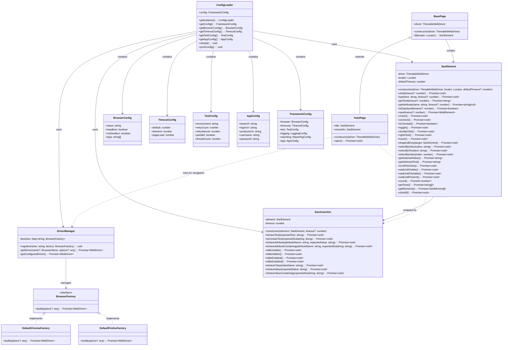

# SaniumTS Selenium Framework

A small TypeScript Selenium framework that demonstrates 4 layers requested:
- SanElement (custom web element wrapper with auto-wait)
- Assertion helpers with retry
- DriverManager (register additional browsers easily)
- Test layer using Page Object Model

## Framework Architecture

```
┌─────────────────────────────────────────────────────────────────────────────┐
│                           👤 USER LAYER                                    │
├─────────────────────────────────────────────────────────────────────────────┤
│  Test Files (.spec.ts)                                                      │
│  └── todo.spec.ts        ──► Todo application tests                        │
│                                                                             │
│  Page Objects                                                               │
│  ├── BasePage (Abstract)                                                    │
│  │   ├── constructor(driver)                                               │
│  │   └── $(locator) ───► SanElement                                        │
│  └── TodoPage extends BasePage                                              │
│      ├── title: SanElement                                                 │
│      ├── moreInfo: SanElement                                              │
│      └── open(): Promise<void>                                             │
└─────────────────┬───────────────────────────────────────────────────────────┘
                  │ uses
                  ▼
┌─────────────────────────────────────────────────────────────────────────────┐
│                      🔧 FRAMEWORK LAYER                                  │
├─────────────────────────────────────────────────────────────────────────────┤
│  ConfigLoader (Singleton)                                                   │
│  ├── BrowserConfig {name, headless, noSandbox, args}                       │
│  ├── TimeoutConfig {default, element, pageLoad}                            │
│  ├── TestConfig {environment, retryCount, retryInterval, parallel}         │
│  └── AppConfig {baseUrl, loginUrl, productsUrl, username, password}        │
│                                                                             │
│  DriverManager                                                              │
│  ├── register(name, factory)                                                │
│  ├── getDriver(name?, options?)                                             │
│  └── getConfiguredDriver()                                                  │
│                                                                             │
│  BrowserFactory (Interface)                                                 │
│  ├── DefaultChromeFactory ────┐                                             │
│  └── DefaultFirefoxFactory ───┼──► WebDriver Instance                      │
│                                                                             │
│  SanElement (Unified wrapper)                                               │
│  ├── Basic: click(), type(), getText(), getAttribute(), isDisplayed()      │
│  ├── Checkboxes: check(), uncheck(), isChecked(), toggle()                 │
│  ├── Mouse: doubleClick(), rightClick(), hover(), dragAndDrop()            │
│  ├── Dropdowns: selectByValue/Text/Index(), getSelectedValue/Text()        │
│  ├── Scrolling: scrollIntoView()                                           │
│  ├── Waiting: waitUntilVisible/Clickable/Present()                         │
│  ├── Collections: count(), getTexts(), getElements(), clickAll()           │
│                                                                             │
│  SanAssertion (Fluent API)                                                  │
│  ├── expectElement(element) ───► Fluent assertions                         │
│  ├── toBeVisible(), toHaveText(), toContainText()                          │
│  ├── toHaveAttribute(), toHaveClass(), toHaveValue()                       │
│  └── Retry logic with configurable timeouts                                │
└─────────────────────────────────────────────────────────────────────────────┘
```

### Key Relationships

#### Configuration Flow
```
.env file → ConfigLoader → FrameworkConfig → All framework components
```

#### Driver Creation Flow
```
ConfigLoader.getBrowserConfig() → DriverManager.getConfiguredDriver() → WebDriver
```

#### Element Interaction Flow
```
PageObject.$(locator) → SanElement → WebElement interactions (single or collections)
```

#### Assertion Flow
```
expectElement(sanElement) → SanAssertion fluent API → Retry-based verifications
```

#### Test Flow
```
Test → PageObject methods → SanElement actions → SanAssertion → Verification
```

### 4-Layer Architecture Benefits

#### 👤 User Layer
- **Test Code**: Focus on business logic and test scenarios
- **Page Objects**: Clean UI abstraction with auto-waiting elements
- **Separation**: User code is isolated from framework internals

#### 🔧 Framework Layer
- **SanElement**: Unified wrapper for single elements and collections
- **DriverManager**: Browser factory with multiple browser support
- **SanAssertion**: Fluent API with retry logic and timeouts
- **ConfigLoader**: Centralized configuration management

### Design Patterns Used

- **Singleton**: ConfigLoader for global configuration
- **Factory**: DriverManager for browser creation
- **Decorator**: SanElement wraps WebElement with auto-wait and advanced methods
- **Fluent Interface**: SanAssertion for readable, chainable assertions
- **Page Object Model**: BasePage and TodoPage for UI abstraction
- **Strategy**: BrowserFactory interface for different browser implementations
- **Unified Interface**: SanElement handles both single elements and collections

### Framework Capabilities

#### SanElement Features
- **Auto-waiting**: All operations wait for elements to be ready
- **Single Elements**: click(), type(), getText(), etc.
- **Collections**: count(), getTexts(), getElements(), clickAll()
- **Checkboxes**: check(), uncheck(), isChecked(), toggle()
- **Mouse Actions**: doubleClick(), rightClick(), hover(), dragAndDrop()
- **Dropdowns**: selectByValue/Text/Index(), getSelectedValue/Text()
- **Advanced**: scrollIntoView(), waitUntilVisible/Clickable/Present()

#### SanAssertion Features
- **Fluent API**: expectElement().toBeVisible().toHaveText()
- **Retry Logic**: Automatic retries with configurable timeouts
- **Rich Assertions**: Text, attributes, visibility, state checks
- **Type Safety**: Full TypeScript support with IntelliSense

## Class Diagram



## Configuration

The framework uses environment-based configuration via `.env` files. Copy the provided `.env` file and modify values for your environment:

```bash
cp .env .env.local  # for local overrides
```

### Configuration Options

- **Browser Settings**:
  - `BROWSER`: `chrome` or `firefox` (BrowserType enum)
  - `HEADLESS`: `true` or `false`
  - `NO_SANDBOX`: `true` or `false`
  - `CHROME_ARGS`: Comma-separated Chrome arguments
  - `FIREFOX_ARGS`: Comma-separated Firefox arguments
- **Timeouts**:
  - `DEFAULT_TIMEOUT`: Default timeout in milliseconds (5000)
  - `ELEMENT_TIMEOUT`: Element wait timeout in milliseconds (10000)
  - `PAGE_LOAD_TIMEOUT`: Page load timeout in milliseconds (30000)
- **Test Settings**:
  - `ENVIRONMENT`: `dev`, `qa`, `staging`, or `prod` (EnvironmentType enum)
  - `RETRY_COUNT`: Number of retry attempts (3)
  - `RETRY_INTERVAL`: Retry interval in milliseconds (500)
  - `PARALLEL`: Enable parallel execution (`false`)
  - `THREAD_COUNT`: Number of parallel threads (2)
- **Application URLs**:
  - `BASE_URL`: Base application URL
  - `LOGIN_URL`: Login page URL
  - `PRODUCTS_URL`: Products page URL
  - `USERNAME`: Default test username
  - `PASSWORD`: Default test password
- **Logging**:
  - `LOG_LEVEL`: `DEBUG`, `INFO`, `WARN`, or `ERROR` (LogLevel enum)
  - `LOG_FILE`: Log file path
- **Reporting**:
  - `SCREENSHOT_ON_FAILURE`: Capture screenshots on failure
  - `VIDEO_RECORDING`: Enable video recording

## Quick start
1. Install dependencies:
```bash
npm install
```
2. Configure your environment in `.env` file
3. Run tests:
```bash
npm test
```

## How to add a new browser
Register a new factory in `src/driver/DriverManager.ts` using `DriverManager.register('mybrowser', myFactory)`; `myFactory` must implement `build()` that returns a `ThenableWebDriver`.

## Page Object Model

Create page classes that extend `BasePage` and define element locators:

```typescript
import { BasePage } from './src/pages/BasePage';

export class LoginPage extends BasePage {
  // User-friendly locator declarations
  usernameField = this.byId('username');
  passwordField = this.byName('password');
  loginButton = this.byCss('button[type="submit"]');
  errorMessage = this.byXpath('//div[@class="error"]');

  // Alternative shorthand syntax
  // usernameField = this.id('username');
  // passwordField = this.name('password');
  // loginButton = this.css('button[type="submit"]');
  // errorMessage = this.xpath('//div[@class="error"]');

  async login(username: string, password: string) {
    await this.usernameField.type(username);
    await this.passwordField.type(password);
    await this.loginButton.click();
  }

  async getErrorMessage() {
    return await this.errorMessage.getText();
  }
}
```

### Available Locator Helpers

- `byCss(selector)` / `css(selector)` - CSS selector
- `byId(id)` / `id(id)` - Element ID
- `byXpath(xpath)` / `xpath(xpath)` - XPath expression
- `byName(name)` / `name(name)` - Name attribute
- `byTag(tagName)` / `tag(tagName)` - Tag name
- `byClass(className)` / `className(className)` - Class name

### Legacy Locator Syntax (Still Supported)

```typescript
// Old verbose syntax (still works)
usernameField = this.$({ using: 'css', value: 'input[name="username"]' });
```

## Assertions

The framework provides a modern Playwright-style fluent assertion API with automatic retry logic.

```typescript
import { expectElement } from './src/assertion/FluentAssertions';

// Text assertions
await expectElement(page.title).toHaveText('Expected Title');
await expectElement(page.description).toContainText('partial text');

// Visibility assertions
await expectElement(button).toBeVisible();
await expectElement(loadingSpinner).toBeHidden();

// State assertions
await expectElement(submitButton).toBeEnabled();
await expectElement(disabledButton).toBeDisabled();

// Attribute assertions
await expectElement(link).toHaveAttribute('href', 'https://example.com');
await expectElement(input).toHaveAttributeContaining('class', 'form-control');

// CSS class assertions
await expectElement(button).toHaveClass('btn-primary');

// Value assertions (for inputs)
await expectElement(input).toHaveValue('expected value');
await expectElement(textarea).toHaveValueContaining('partial');
```

All assertions include automatic retry logic based on your `.env` configuration (`RETRY_COUNT` and `RETRY_INTERVAL`).

## Allure Reporting

The framework includes comprehensive Allure reporting for beautiful, interactive test reports with screenshots, test steps, and detailed execution information.

### Running Tests with Allure Reports

**Important Note**: Allure reporting works best in single-threaded mode. When running tests in parallel, Allure will show warnings but will still generate fallback console logging.

```bash
# Run tests with Allure reporting (single-threaded for best results)
npm run test:allure

# Run Allure demo (single-threaded)
npm run test:allure-demo

# Generate and open Allure report
npm run report:allure
```

### Using Allure in Tests

```typescript
import { AllureReporter, AllureTestHooks } from './src/reporting';

describe('My Test Suite', () => {
  let driver: any;

  before(async () => {
    await AllureTestHooks.beforeAll();
    driver = await DriverManager.getConfiguredDriver();
    AllureTestHooks.setDriver(driver);
  });

  beforeEach(async () => {
    await AllureTestHooks.beforeEach();
  });

  afterEach(async () => {
    await AllureTestHooks.afterEach();
  });

  after(async () => {
    await AllureTestHooks.afterAll();
  });

  it('should perform user login', async () => {
    AllureReporter.description('Test user login functionality');
    AllureReporter.severity('critical');
    AllureReporter.tag('login');
    AllureReporter.tag('smoke');

    await AllureReporter.step('Navigate to login page', async () => {
      await page.navigateToLogin();
    });

    await AllureReporter.step('Enter credentials', async () => {
      await page.enterUsername('testuser');
      await page.enterPassword('password123');
    });

    await AllureReporter.step('Submit login form', async () => {
      await page.clickLogin();
    });

    await AllureReporter.step('Verify login success', async () => {
      await expectElement(page.welcomeMessage).toBeVisible();
    });

    // Attach screenshot
    await AllureReporter.attachScreenshot(driver, 'Login success');
  });
});
```

### Allure Features

- **Test Steps**: Break down tests into logical steps with `AllureReporter.step()`
- **Screenshots**: Automatic screenshots on test failures and manual capture
- **Test Metadata**: Add descriptions, severity levels, tags, and owners
- **Attachments**: Attach text, JSON, files, and custom data
- **Environment Info**: Automatic environment configuration reporting
- **Interactive Reports**: Beautiful web interface with filtering and search

### Allure API Reference

```typescript
// Test metadata
AllureReporter.description('Test description');
AllureReporter.severity('blocker' | 'critical' | 'normal' | 'minor' | 'trivial');
AllureReporter.tag('tag-name');
AllureReporter.owner('developer-name');
AllureReporter.parameter('param-name', 'param-value');

// Test steps
await AllureReporter.step('Step name', async () => {
  // step implementation
});

// Attachments
await AllureReporter.attachScreenshot(driver, 'Screenshot name');
AllureReporter.attachText('Log name', 'Log content');
AllureReporter.attachJSON('Data name', { key: 'value' });
AllureReporter.attachFile('File name', '/path/to/file');

// Logging
AllureReporter.logAction('User action performed', { details: 'data' });
```